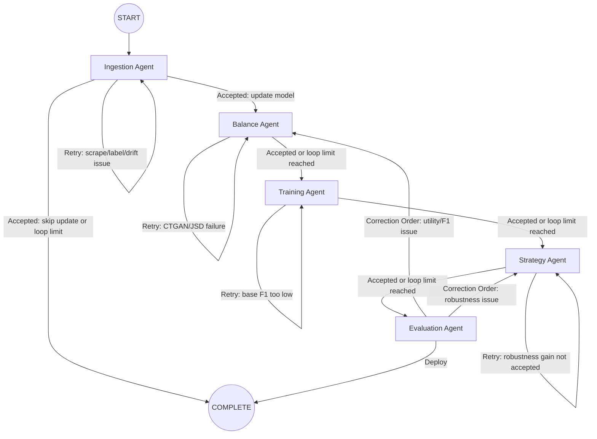

# Agentic Fraud Workflow

This document describes the workflow implemented in `agent-new/`. The current system is a **LangGraph** pipeline with five executable agents plus a completion node. Each agent runs concrete tool wrappers, records state in memory, and uses a lightweight **DecisionEngine** to summarize results and choose the next transition .

## Workflow Graph



## Runtime Stages

### 1. Ingestion Agent

**Objective**: refresh Reddit data, label it, preprocess it, append usable examples into the train/test splits, and assess whether the new batch is trustworthy enough to continue.

**Tools**
- `reddit_scraper`
- `reddit_labeller`
- `post_processor`
- `dataset_append`
- `dataset_profiler`
- `label_review`

**Implemented checks**
- retries if scraping, labeling, or preprocessing returns a non-zero exit code
- retries if `label_noise_score > 0.18`
- retries if `slang_drift_score > 0.12`
- retries if label review returns `recommendation = "relabel"`
- terminates early (`skip_model_update`) if quality passes but not enough new fraud rows are added (e.g. `< 2`) and bootstrap is not used.

**Primary outputs**
- scraped and labeled files under `Data labeling/outputs/`
- updated `train_3k.csv` and `test_3k.csv`
- profiling summary covering class balance, label noise, and slang drift

### 2. Balance Agent

**Objective**: choose a balancing ratio, generate CTGAN data, and reject synthetic output that diverges too far from the real distribution.

**Tools**
- `balance_search`
- `ctgan_runner`
- `synthetic_quality`

**Implemented checks**
- ratio candidates come from `DEFAULT_RATIO_CANDIDATES = (10, 18, 20)`
- synthetic data is accepted only when CTGAN succeeds and `mean_jsd <= 0.20`
- otherwise the stage loops back into balancing

**Primary outputs**
- selected ratio candidate with estimated utility
- `Fin-Fraud_AI/CTGAN/ctgan_balanced_data.csv`
- per-column and mean Jensen-Shannon divergence summary

### 3. Training Agent

**Objective**: run baseline model training and verify that the non-adversarial model quality is strong enough before investing in adversarial strategy work.

**Tools**
- `classifier_training`

**Implemented checks**
- executes `Fin-Fraud_AI/classifier_models/comprehensive_eval.py`
- restricts training evaluation to `Original,CTGAN` datasets via environment variable
- passes only if the training script succeeds and `best_f1 >= 0.738`

`0.738` is derived from `TARGET_F1_THRESHOLD * 0.9`, with `TARGET_F1_THRESHOLD = 0.82`.

### 4. Strategy Agent

**Objective**: run adversarial training, inspect likely attack surface, and accept the strategy only if robustness does not regress under attack.

**Tools**
- `adversarial_trainer`
- `attack_surface`

**Implemented checks**
- attack-surface analysis inspects long-form text ratio and fraud-channel counts
- focus shifts toward `distribution_shift_fraud` when CTGAN quality is borderline
- adversarial training is accepted only when both adversarial scripts succeed and `robustness_gain >= 0.0`
- robustness gain is computed as `adversarial_attack_f1 - baseline_attack_f1`

**Primary outputs**
- adversarial summary table and robustness curve in `9k-dataset/adversial/results/`
- recommended focus such as `long-form text fraud` or `transactional short-form fraud`

### 5. Evaluation Agent

**Objective**: perform final quality gates and either approve deployment or emit a correction order.

**Tools**
- `evaluation_runner`

**Implemented checks**
- runs classifier evaluation and robustness evaluation from `Fin-Fraud_AI`
- deploys only when:
  - `best_f1 >= 0.82`
  - `robustness_score >= 0.70`
  - both evaluation scripts exit successfully

**Correction logic**
- routes back to `Balance Agent` if F1 is below threshold
- routes back to `Strategy Agent` if F1 passes but robustness is below threshold

## Decision Engine

Each stage calls `DecisionEngine.decide(...)` from [`agent-new/graph.py`](/home/norm/Projects/Reddit-dataset/agent-new/graph.py), which:

1. packages tool outputs into a JSON payload
2. prompts an Ollama-backed chat model with the agent role and objective
3. expects a strict JSON response with `summary`, `action`, `confidence`, and `metadata`
4. falls back to deterministic rule-based output when LangChain/Ollama is unavailable or returns invalid JSON

**Configured model**
- `OLLAMA_MODEL = "qwen3.5:0.8b"`
- `OLLAMA_URL = "http://127.0.0.1:11434"`

The LLM summary is informational. Routing is ultimately enforced by explicit rule checks in the graph.

## State, Memory, and Reports

The workflow state tracks:
- `iteration`
- per-agent result payloads
- `decisions`
- `next_step`
- `done`
- `status`

Persistent records are written to:
- [`agent-new/memory/agent_memory.json`](/home/norm/Projects/Reddit-dataset/agent-new/memory/agent_memory.json)
- [`agent-new/output/run_report.json`](/home/norm/Projects/Reddit-dataset/agent-new/output/run_report.json)
- [`agent/audit_log.jsonl`](/home/norm/Projects/Reddit-dataset/agent/audit_log.jsonl)

The memory store accumulates snapshots, decisions, artifact references, and full run reports across executions.

## Loop Control and Thresholds

The main workflow thresholds live in [`agent-new/config.py`](/home/norm/Projects/Reddit-dataset/agent-new/config.py):

- `MAX_REVIEW_LOOPS = 6`
- `LABEL_NOISE_THRESHOLD = 0.18`
- `SLANG_DRIFT_THRESHOLD = 0.12`
- `MIN_JS_DIVERGENCE_ACCEPT = 0.20`
- `TARGET_F1_THRESHOLD = 0.82`
- `TARGET_ROBUSTNESS_THRESHOLD = 0.70`
- `MIN_NEW_FRAUD_ROWS_TO_UPDATE = 2`

If an agent keeps failing but the global iteration count reaches the loop cap, the graph advances to the next stage instead of retrying forever.

## Entry Point

Run the workflow with:

```bash
python agent-new/main.py
```

This invokes `run_workflow()` from `agent-new/graph.py`, compiles the LangGraph state machine, executes the pipeline from `START`, and prints the final state as JSON.
