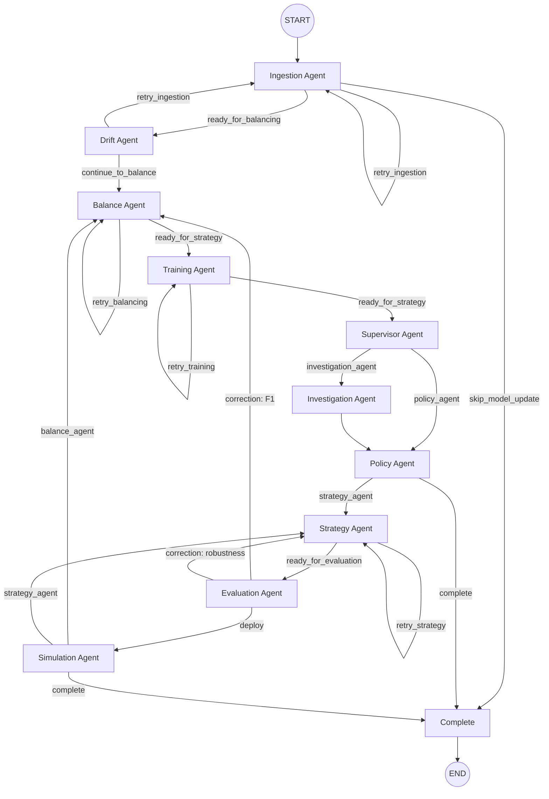

# Agentic Fraud Workflow

This document describes the workflow implemented in `agent-new/`. The current system is a LangGraph pipeline with ten executable agents plus a completion node. Each agent runs concrete tool wrappers, records state in memory, and uses a `DecisionEngine` to send a `Role` and `Objective` prompt to the LLM before selecting the next transition.

## Overall Goal

The goal of this agentic flow is to autonomously govern fraud-model updates by deciding when to ingest, rebalance, retrain, investigate, harden, evaluate, and approve deployment under explicit quality and robustness constraints.

This is agentic because the workflow does not just execute a fixed linear pipeline. Each stage evaluates state, inspects tool outputs, chooses an action, and can retry, escalate, skip, or terminate based on the current evidence.

## Workflow Graph



## Runtime Prompt Format

Each LLM-backed decision uses the same prompt structure from [`agent-new/graph.py`](/home/norm/Projects/Reddit-dataset/agent-new/graph.py):

- `Role: <AgentName>`
- `Objective: <agent objective>`
- `Payload: <JSON tool outputs and state>`

At runtime, the console now prints the same `Role` and `Objective` strings that are passed into `DecisionEngine.decide(...)`.

## Runtime Stages

### 1. Ingestion Agent

**Role**: `IngestionAgent`

**Objective**: ingest Reddit data through scraping, labeling, post-processing, train/test append, then assess label quality and slang drift.

**Tools**
- `reddit_scraper`
- `reddit_labeller`
- `post_processor`
- `dataset_append`
- `dataset_profiler`
- `label_review`

**Underlying execution**
- `reddit_scraper` runs the scraper script configured by `SCRAPER_SCRIPT_PATH`
- `reddit_labeller` runs the labeling script configured by `LABEL_SCRIPT_PATH`
- `post_processor` runs the preprocessing script configured by `PREPROCESS_SCRIPT_PATH`
- `dataset_append` appends processed rows into dataset/train/test splits
- `dataset_profiler` computes class balance, label noise, and slang drift
- `label_review` samples rows and recommends `keep` or `relabel`

**Routing**
- `retry_ingestion` on scrape/label/post-process failure, ingestion gap, or poor quality
- `ready_for_balancing` when the batch is acceptable
- `skip_model_update` when quality passes but update criteria are not met

### 2. Drift Agent

**Role**: `DriftAgent`

**Objective**: assess dataset drift and label quality before balancing. Retry ingestion only when the dataset health is unacceptable.

**Tools**
- none directly

**Consumes**
- `profile` and `review` outputs produced by `IngestionAgent`

**Routing**
- `retry_ingestion`
- `continue_to_balance`

### 3. Balance Agent

**Role**: `BalanceAgent`

**Objective**: pick a balancing ratio and reject low-fidelity CTGAN output if JSD is too high.

**Tools**
- `balance_search`
- `ctgan_runner`
- `synthetic_quality`

**Underlying execution**
- `balance_search` may run [`run_xgb_ctgan_3k.py`](/home/norm/Projects/Reddit-dataset/9k-dataset/scripts/experiments/3k_data/run_xgb_ctgan_3k.py) across candidate ratios and score them by validation metrics
- `ctgan_runner` runs the CTGAN/classifier pipeline via `CTGAN_SCRIPT_PATH`
- `synthetic_quality` compares real and synthetic non-fraud numeric columns with Jensen-Shannon divergence

**Acceptance rule**
- accepted when no synthetic rows are required, or when CTGAN succeeds, produces fresh output, and `mean_jsd <= MIN_JS_DIVERGENCE_ACCEPT`

**Routing**
- `retry_balancing`
- `ready_for_strategy`

### 4. Training Agent

**Role**: `TrainingAgent`

**Objective**: evaluate base model training results. Proceed if F1 score is acceptable.

**Tools**
- `classifier_training`

**Underlying execution**
- `classifier_training` runs [`run_xgb_ctgan_3k.py`](/home/norm/Projects/Reddit-dataset/9k-dataset/scripts/experiments/3k_data/run_xgb_ctgan_3k.py) via `TRAINING_SCRIPT_PATH`

**Acceptance rule**
- passes when the script succeeds and `best_f1 >= TARGET_F1_THRESHOLD * 0.9`

**Routing**
- `retry_training`
- `ready_for_strategy`

### 5. Supervisor Agent

**Role**: `SupervisorAgent`

**Objective**: route the workflow between direct policy review and deeper investigation based on model quality, drift, and synthetic-data fidelity.

**Tools**
- none directly

**Consumes**
- training pass/fail state
- drift score
- synthetic JSD

**Routing**
- `policy_agent`
- `investigation_agent`

### 6. Investigation Agent

**Role**: `InvestigationAgent`

**Objective**: review the attack surface and recommend whether policy should harden the model path or continue with standard review.

**Tools**
- `attack_surface`

**Underlying execution**
- `attack_surface` measures long-form text ratio and fraud-channel counts from the current dataset/test slice

**Routing**
- always returns to `policy_agent`

### 7. Policy Agent

**Role**: `PolicyAgent`

**Objective**: create a policy proposal for the next workflow step and approve it when the proposal is internally consistent.

**Tools**
- none directly

**Outputs**
- `proposal`
- `approval`

**Routing**
- `strategy_agent`
- `complete`

### 8. Strategy Agent

**Role**: `StrategyAgent`

**Objective**: run adversarial training on the balanced model candidate, capture robustness gain, and decide whether the strategy stage is acceptable.

**Tools**
- `adversarial_trainer`

**Underlying execution**
- `adversarial_trainer` first runs `AttackSurfaceTool().run()`
- then runs the scripts configured by `ADVERSARIAL_TRAINING_SCRIPT_PATH` and `ROBUSTNESS_CURVE_SCRIPT_PATH`

**Acceptance rule**
- accepted when both scripts succeed and `robustness_gain >= 0.0`

**Routing**
- `retry_strategy`
- `ready_for_evaluation`

### 9. Evaluation Agent

**Role**: `EvaluationAgent`

**Objective**: approve deployment only if F1 and robustness satisfy thresholds; otherwise issue correction orders.

**Tools**
- `evaluation_runner`

**Underlying execution**
- `evaluation_runner` runs the scripts configured by `TRAINING_SCRIPT_PATH` and `ROBUSTNESS_SCRIPT_PATH`
- then reads classifier metrics and robustness outputs

**Acceptance rule**
- `best_f1 >= TARGET_F1_THRESHOLD`
- `non_fraud_f1 >= TARGET_NON_FRAUD_F1_THRESHOLD`
- `robustness_score >= TARGET_ROBUSTNESS_THRESHOLD`
- both scripts exit successfully

**Routing**
- `deploy` -> `SimulationAgent`
- correction to `BalanceAgent` when F1 is below threshold
- correction to `StrategyAgent` when robustness is the blocker

### 10. Simulation Agent

**Role**: `SimulationAgent`

**Objective**: simulate the release decision offline and approve completion only when all guardrails still pass.

**Tools**
- none directly

**Consumes**
- evaluation outputs
- policy proposal mode

**Routing**
- `complete`
- `balance_agent`
- `strategy_agent`

## Decision Engine

Each stage calls `DecisionEngine.decide(...)` from [`agent-new/graph.py`](/home/norm/Projects/Reddit-dataset/agent-new/graph.py), which:

1. builds a prompt with `Role`, `Objective`, and a JSON `Payload`
2. sends that prompt to the configured Ollama model when available
3. expects a JSON response with `summary`, `action`, `confidence`, and `metadata`
4. falls back to deterministic rule-based output when Ollama/LangChain is unavailable or the response is invalid

The LLM output is advisory. Final routing is still enforced by explicit rule checks in the graph.

## State, Memory, and Reports

The workflow state tracks:
- `iteration`
- `agent_attempts`
- per-agent result payloads
- `scores`
- `proposal`
- `approval`
- `outcome`
- `decisions`
- `next_step`
- `done`
- `status`

Persistent records are written to:
- [`agent-new/memory/agent_memory.json`](/home/norm/Projects/Reddit-dataset/agent-new/memory/agent_memory.json)
- [`agent-new/output/run_report.json`](/home/norm/Projects/Reddit-dataset/agent-new/output/run_report.json)
- [`agent-new/output/run_summary.md`](/home/norm/Projects/Reddit-dataset/agent-new/output/run_summary.md)
- [`agent-new/output/evaluation/decision_model_log.json`](/home/norm/Projects/Reddit-dataset/agent-new/output/evaluation/decision_model_log.json)

Execution tracing is also written to:
- [`agent-new/output/execution_trace.jsonl`](/home/norm/Projects/Reddit-dataset/agent-new/output/execution_trace.jsonl)
- [`agent-new/output/audit_log.jsonl`](/home/norm/Projects/Reddit-dataset/agent-new/output/audit_log.jsonl)

## Loop Control and Thresholds

The main workflow thresholds live in [`agent-new/config.py`](/home/norm/Projects/Reddit-dataset/agent-new/config.py):

- `MAX_REVIEW_LOOPS`
- `LABEL_NOISE_THRESHOLD`
- `SLANG_DRIFT_THRESHOLD`
- `MIN_JS_DIVERGENCE_ACCEPT`
- `TARGET_F1_THRESHOLD`
- `TARGET_NON_FRAUD_F1_THRESHOLD`
- `TARGET_ROBUSTNESS_THRESHOLD`

Most retry-capable agents stop retrying once `MAX_REVIEW_LOOPS` is reached and route to `complete` instead of looping forever.

## Entry Point

Run the workflow with:

```bash
python agent-new/main.py
```

or:

```bash
python3 agent-new/main.py
```

This invokes `run_workflow()` from [`agent-new/graph.py`](/home/norm/Projects/Reddit-dataset/agent-new/graph.py), compiles the LangGraph state machine, executes the pipeline from `START`, and prints the final state as JSON.
